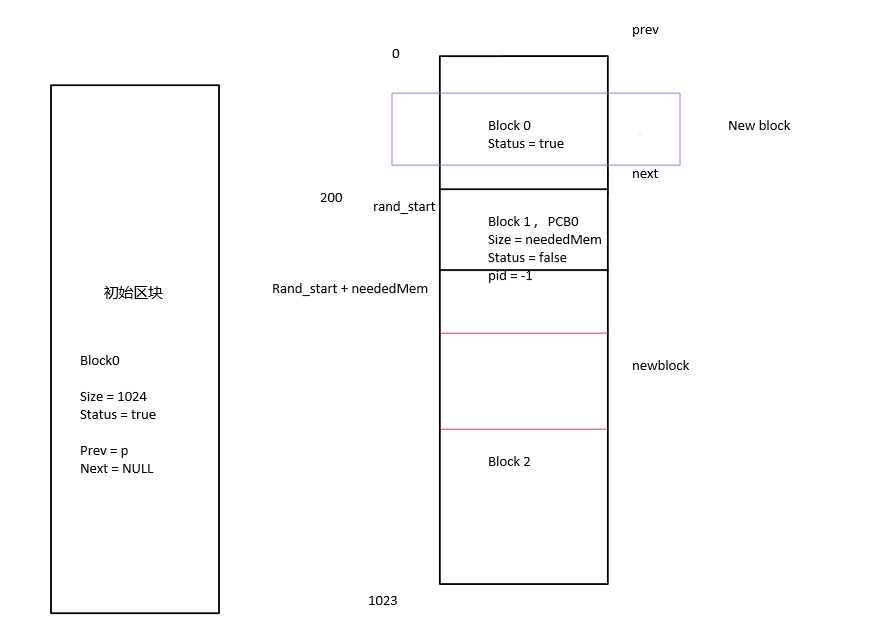

# C_FF_NF
Memory Simulator Management, using linked list, next-fit, first-fit algorithms. 内存分配模拟  
本代码实现的是一个作业题，https://imoe.vip/c-program-%e6%a8%a1%e6%8b%9f%e5%9f%ba%e4%ba%8e%e9%93%be%e8%a1%a8%e7%9a%84%e5%8a%a8%e6%80%81%e5%88%86%e5%8c%ba%e5%88%86%e9%85%8d%e7%9a%84%e9%a6%96%e6%ac%a1%e9%80%82%e5%ba%94%e7%ae%97%e6%b3%95first-fit/ 题目放博客里了。  
大致草图如图  
  
